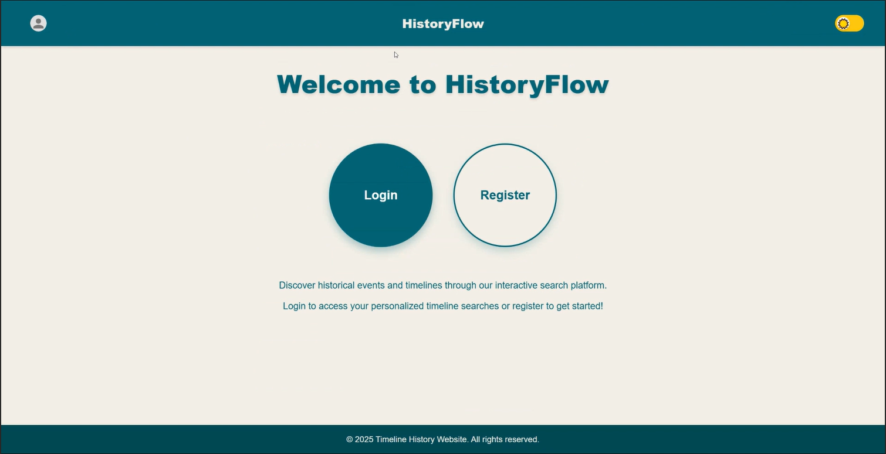
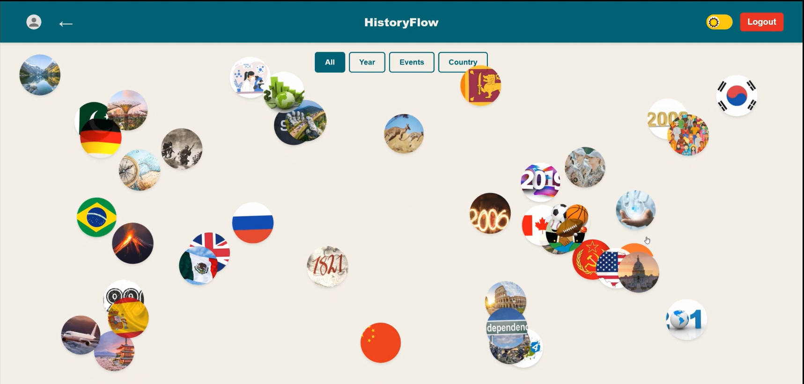
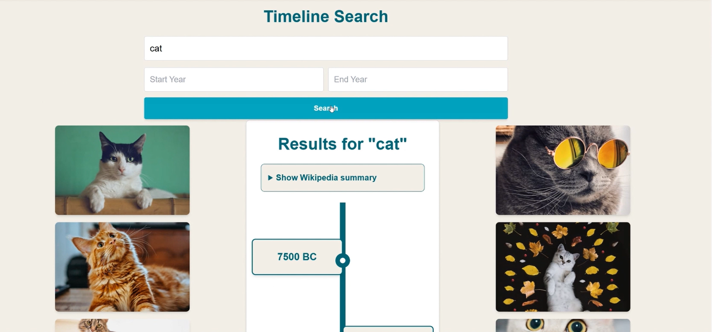
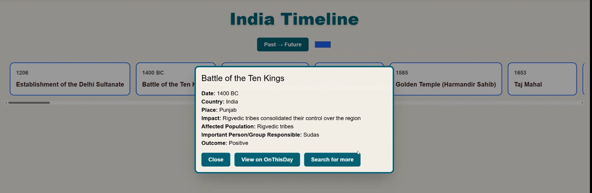
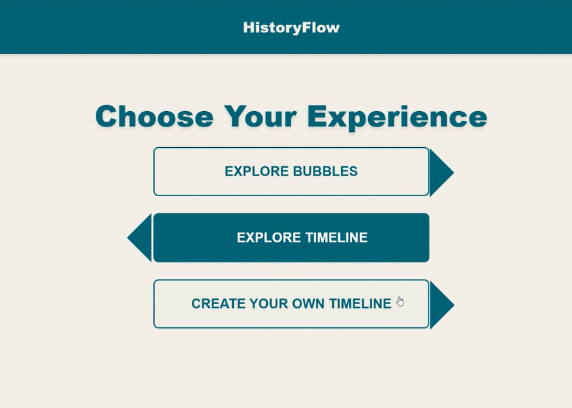

⏳ HistoryFlow

AI-Powered Interactive Timeline Generator

HistoryFlow is a full-stack web app that generates dynamic historical timelines using AI and real-time data.

## 📸 Preview

### 🏠 Home

### 🫧 Interactive Bubbles

### 📚 Wikipedia Timeline

### 🗂 Database Timeline

### ⚙️ Experience Options

🚀 Features

AI-powered topic search (Wikipedia + Gemini AI)

Interactive responsive timeline (React + Tailwind)

Create, edit & save custom timelines

Automatic event images (Unsplash API)

Secure authentication (JWT + Bcrypt)

🛠 Tech Stack

Frontend: React, Tailwind CSS
Backend: Node.js, Express
Database: MongoDB (Mongoose)
APIs: Gemini AI, Wikipedia API, Unsplash
Deployment: Vercel

⚙️ Installation
git clone https://github.com/YOUR_USERNAME/historyflow.git

Install dependencies
# Frontend
cd react-timeline
npm install

# Backend
cd ../server
npm install

Environment Variables (.env in server folder)
MONGODB_URI=your_mongodb_connection_string
GEMINI_API_KEY=your_key
UNSPLASH_ACCESS_KEY=your_key
JWT_SECRET=your_secret

Run the project
# Frontend
cd react-timeline
npm start

# Backend
cd server
node server.js
